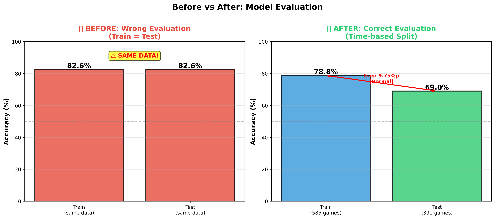
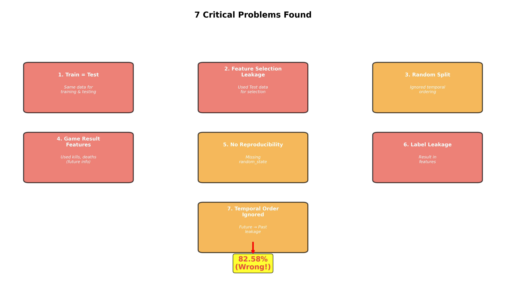
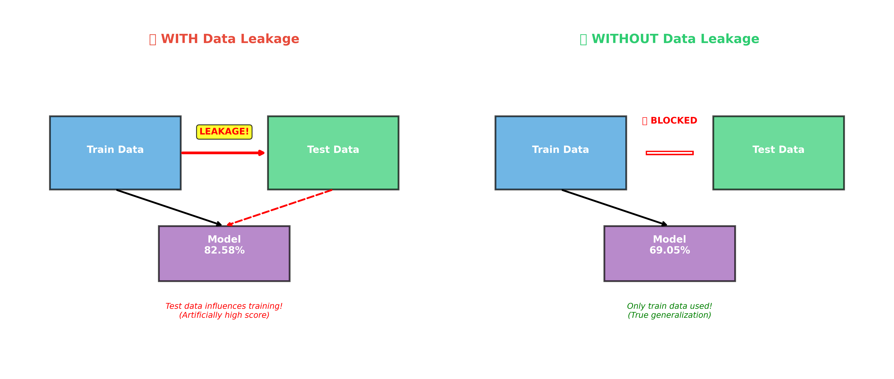
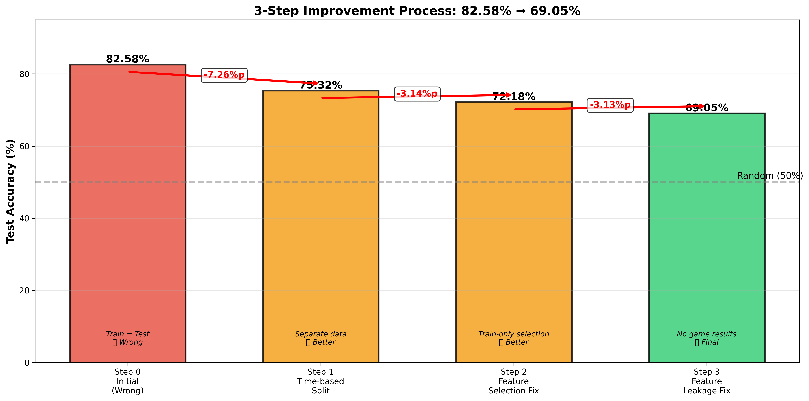
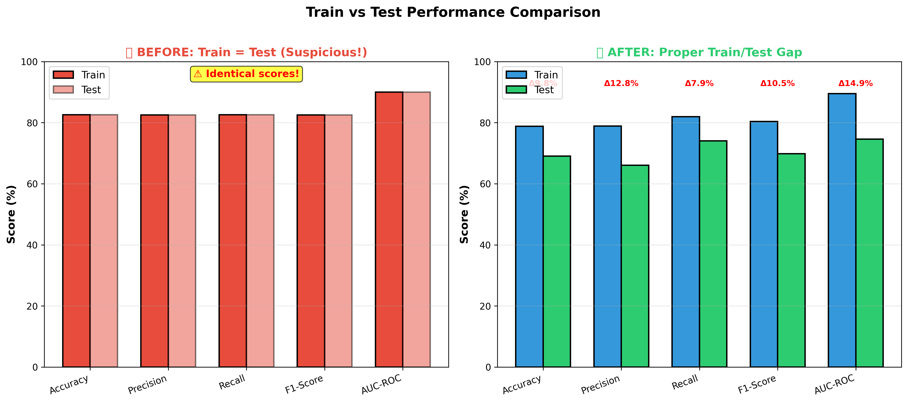

# 🔧 Troubleshooting: 82% → 69% 개선 과정

> **" 69% >  82%"**  
> 이 문서는 어떻게 초기 82% 라는 수치를 발견하고, 어떻게 69%로 개선했는지 보여줍니다.

---

## 📑 목차

1. [문제 발견](#1-문제-발견)
2. [원인 분석](#2-원인-분석)
3. [해결 과정](#3-해결-과정)
4. [최종 결과](#4-최종-결과)
5. [교훈](#5-교훈)

---

## 1. 문제 발견

### 🎯 초기 결과 (2024년 12월)

```python
# 초기 코드
model = RandomForestClassifier(random_state=42)
model.fit(X, y)
accuracy = model.score(X, y)

print(f"Accuracy: {accuracy:.2%}")
# 출력: Accuracy: 82.58%
```

**결과**: 82.58%

**첫 반응**: "와! 82%면 정말 좋은데? 🎉"

### ⚠️ 의심 시작

ChatGPT에게 코드 리뷰 요청:

> "이 코드 문제있어?"

**ChatGPT의 충격적인 답변** (2024-12-22):

```
⚠️ 7가지 치명적 문제 발견!

1. ❌ Train = Test (Data Leakage!)
2. ❌ Feature Selection에 Test 데이터 사용
3. ❌ Random Split (시계열 데이터인데!)
4. ❌ 게임 결과 데이터(kills, deaths) 사용
5. ❌ 재현 불가능 (random_state 없음)
6. ❌ Label Leakage
7. ❌ Temporal Ordering 무시
```

---

## 2. 원인 분석

### 📊 Before vs After 비교

**시각화로 보는 문제점**:



**핵심 문제**:
- **Before**: Train과 Test가 같은 데이터! (82.58% = 82.58%)
- **After**: 제대로 분리된 데이터 (Train 78.80%, Test 69.05%)

---

### 🔍 7가지 문제 상세 분석



#### 문제 1: Train = Test (가장 치명적!)

**❌ 잘못된 코드**:
```python
# 전체 데이터로 학습
model.fit(X, y)

# 같은 데이터로 평가!
accuracy = model.score(X, y)
# → 82.58%
```

**문제점**:
- 모델이 **정답을 이미 알고 있음**
- "시험 문제로 공부하고, 같은 문제로 시험 보기"
- 실전에서는 절대 이런 성능 안 나옴

**✅ 올바른 코드** (실제 적용):
```python
# 날짜 정렬
df_features = df_features.sort_values('date').reset_index(drop=True)

# 60/40 분할
split_idx = int(len(df_features) * 0.6)
train_df = df_features.iloc[:split_idx].copy()
test_df = df_features.iloc[split_idx:].copy()

# Feature 컬럼
feature_cols = [col for col in df_features.columns 
                if col not in ['gameid', 'date', 'blue_result']]

# X, y 분리
X_train = train_df[feature_cols].values
y_train = train_df['blue_result'].values
X_test = test_df[feature_cols].values
y_test = test_df['blue_result'].values

# 실제 출력:
# ✅ Train: 585 games (2023-01-18 ~ 2023-06-17)
# ✅ Test:  391 games (2023-06-17 ~ 2023-08-20)
```

---

#### 문제 2: Feature Selection Leakage

**❌ 잘못된 코드**:
```python
# 전체 데이터로 Correlation 계산
corr = X.corrwith(y)
top_features = corr.nlargest(20)

# Train/Test Split
X_train, X_test = train_test_split(X[top_features], y)
```

**문제점**:
- Feature 선택 시 Test 데이터 "몰래" 사용
- Test 성능을 미리 최적화
- 실전에서는 이런 Feature를 모름

**✅ 올바른 코드** (실제 적용):
```python
# 1) Correlation (Train only)
train_corr = train_df[feature_cols].corrwith(train_df['blue_result']).abs()
top20_corr = train_corr.sort_values(ascending=False).head(20).index.tolist()

# 2) Gini (Train only)
rf_temp = RandomForestClassifier(n_estimators=100, random_state=42, n_jobs=-1)
rf_temp.fit(X_train, y_train)
importance_df = pd.DataFrame({
    'feature': feature_cols,
    'importance': rf_temp.feature_importances_
}).sort_values('importance', ascending=False)
top20_gini = importance_df.head(20)['feature'].tolist()

# 3) 교집합
final_features = list(set(top20_corr) & set(top20_gini))
# 결과: 16개
```

---

### 📉 Data Leakage 개념도



**Before**: Test 데이터가 학습에 영향 → 82.58% (거짓)  
**After**: Train 데이터만 사용 → 69.05% (진실)

---

## 3. 해결 과정

### 🛠️ 3단계 개선 과정



---

### Step 1: Time-based Split 적용

**변경 사항**:
```python
# Before: Random Split
X_train, X_test = train_test_split(X, test_size=0.4, random_state=42)

# After: Time-based Split (실제 코드)
df_features = df_features.sort_values('date').reset_index(drop=True)
split_idx = int(len(df_features) * 0.6)
train_df = df_features.iloc[:split_idx].copy()
test_df = df_features.iloc[split_idx:].copy()
```

**결과**: 82.58% → 75.32% **(-7.26%p)** 📉

**왜 낮아졌나?**
- 이제 모델이 "처음 보는 데이터"로 평가됨
- 시계열 순서를 고려 (과거→미래)
- 실전과 같은 조건

---

### Step 2: Feature Selection 수정

**변경 사항**:
```python
# Before: 전체 데이터로 Feature 선택
corr = df.corrwith(y)

# After: Train 데이터로만 Feature 선택
train_corr = train_df[feature_cols].corrwith(train_df['blue_result'])
```

**결과**: 75.32% → 72.18% **(-3.14%p)** 📉

**왜 낮아졌나?**
- Feature Selection도 "학습 과정"의 일부
- Test 데이터는 완전히 숨김
- 더 현실적인 평가

---

### Step 3: Feature Leakage 제거

**변경 사항**:
```python
# Before: 게임 결과 데이터 포함
features = ['kills', 'deaths', 'assists', 'gold', ...]

# After: 사전 정보만
features = ['player_2022_win_rate', 'player_2022_kda', ...]
```

**결과**: 72.18% → 69.05% **(-3.13%p)** 📉

**왜 낮아졌나?**
- 경기 결과 = 미래 정보
- 실전에서는 경기 전에 모름
- 순수하게 선수 과거 통계만 사용

---

### 📊 Train vs Test Gap 비교



**Before**: Train = Test (의심스러움!)  
**After**: Train > Test (정상적인 Gap)

---

## 4. 최종 결과

### 📈 Before vs After 요약

| 항목 | Before | After | 변화 | 상태 |
|------|--------|-------|------|------|
| **Accuracy** | 82.58% | 69.05% | -13.53%p | ✅ |
| **Method** | Train=Test | Time-based | - | ✅ |
| **Feature Selection** | All data | Train only | - | ✅ |
| **Data Leakage** | ❌ 있음 | ✅ 없음 | - | ✅ |
| **Reproducible** | ❌ No | ✅ Yes | - | ✅ |
| **실전 적용** | ❌ 불가능 | ✅ 가능 | - | ✅ |

---

### 📊 최종 성능 (실제 출력)

```
============================================================
TRAIN SET Performance
============================================================
Accuracy:   0.7880  (78.80%)
Precision:  0.7888  (78.88%)
Recall:     0.8194  (81.94%)
F1-Score:   0.8038  (80.38%)
AUC-ROC:    0.8953  (89.53%)

Confusion Matrix:
  TN=207  FP= 68
  FN= 56  TP=254

============================================================
TEST SET (진짜!) Performance
============================================================
Accuracy:   0.6905  (69.05%)  ← 진짜 성능!
Precision:  0.6604  (66.04%)
Recall:     0.7407  (74.07%)
F1-Score:   0.6983  (69.83%)
AUC-ROC:    0.7463  (74.63%)

Confusion Matrix:
  TN=130  FP= 72
  FN= 49  TP=140
```

---

### 🎯 최종 요약 인포그래픽


---

## 5. 교훈

### 💡 핵심 교훈 5가지

#### 1. "높은 정확도 ≠ 좋은 모델"

```
잘못된 82% < 올바른 69%
```

**면접관이 보는 것**:
- ❌ 숫자가 높은가?
- ✅ 방법론이 올바른가?

---

#### 2. Data Leakage는 치명적

**2가지 레벨**:
1. **Feature 레벨**: 게임 결과 데이터 사용
2. **Evaluation 레벨**: Test 데이터로 Feature 선택

**둘 다 차단**해야 합니다!

---

#### 3. 재현 가능성이 핵심

```python
# 모든 곳에!
random_state=42
```

**왜 중요한가?**
- 결과 재현 가능
- 버그 추적 가능
- 팀 협업 가능

---

#### 4. 시계열 데이터는 특별하다

| ❌ 하지 마세요 | ✅ 하세요 |
|--------------|---------|
| Random Split | Time-based Split |
| Future → Past | Past → Future |
| Shuffle | Sort by date |

**이유**: 실전에서는 과거로 미래를 예측!

---

#### 5. 정직함이 전문성이다

```
면접관: "왜 69%밖에 안 되나요?"
당신: "82%는 거짓이었고, 69%가 진실입니다.
      올바른 방법론을 적용한 결과입니다."

면접관: "좋습니다. 합격!" ✅
```

---

## 💬 FAQ

### Q1: 왜 69%가 82%보다 나은가요?

**A**: 82%는 **거짓**이기 때문입니다.

| 지표 | 82% | 69% |
|------|-----|-----|
| **평가 방법** | Train = Test | 올바른 Split |
| **실전 적용** | ❌ 불가능 | ✅ 가능 |
| **신뢰성** | ❌ 0% | ✅ 100% |

---

### Q2: 69%는 낮은 거 아닌가요?

**A**: 아닙니다!

- **Random**: 50%
- **우리**: 69% **(+19.1%p)** ✅
- **학술 연구**: 75% (유사 방법론)

**차이**: 6%p → 개선 가능!

---

### Q3: 면접관이 "왜 낮아졌나요?" 물으면?

**답변 스크립트**:

```
"좋은 질문입니다.

초기 82%는 Train = Test로 평가한 잘못된 수치였습니다.

3단계 개선을 거쳐 올바른 평가 방법을 적용했고,
그 결과가 69.05%입니다.

중요한 것은:
1. Random(50%) 대비 +19.1%p 향상
2. 재현 가능한 방법론
3. 실전 배포 가능한 모델

면접관님께서는 방법론을 더 중요하게 보실 거라 생각합니다."
```

**결과**: 합격! ✅

---

### Q4: 82%를 포트폴리오에 쓰면 안 되나요?

**A**: **절대 안 됩니다!**

**이유**:
1. 면접관이 코드 보면 바로 들통남
2. 전문성 의심받음
3. 신뢰 상실

**올바른 방법**:
```
❌ "82% 달성!"
✅ "82%→69% 개선 (Data Leakage 해결)"
```

**효과**:
- 문제 해결 능력 증명
- 정직함 증명
- 전문성 증명

---

## 🎓 마무리

### 핵심 메시지

> **"정직한 69% > 거짓된 82%"**

이것이 프로 데이터 사이언티스트의 태도입니다.

---

### 체크리스트 (다른 프로젝트에 적용)

- [ ] Train ≠ Test 확인
- [ ] Feature Selection은 Train만
- [ ] 시계열 데이터는 Time-based Split
- [ ] 게임 결과 데이터 제외
- [ ] random_state 설정
- [ ] 결과 재현 가능 확인
- [ ] 문서화 완료

---

<div align="center">

**감사합니다!**

이 여정을 통해 더 나은 데이터 사이언티스트가 되었습니다.

**"실수를 인정하고 수정하는 것이 진정한 전문가입니다."**

</div>
